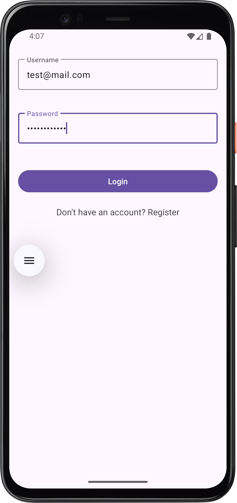

Here’s an **awesome README file** template for your project that highlights interactivity and professionalism. It includes all the technologies you listed and presents them effectively:

---

# 📸 PicExplorer - Explore Stunning Images Effortlessly!

Welcome to **PicExplorer**, your go-to app for discovering and exploring a vast collection of beautiful images. This app is built using cutting-edge Android technologies to provide a seamless and interactive user experience. 🚀

---

## ✨ Features

- 🔍 **Explore Images**: Search and browse through stunning images with real-time pagination.
- 🖼️ **Detail View**: Dive deep into image details like size, type, tags, views, likes, comments, and downloads.
- 📂 **Clean Architecture**: Robust and scalable codebase following modern Android development practices.
- ⚡ **High Performance**: Smooth scrolling and data binding ensure a responsive user experience.

---

## 🛠️ Technologies Used

| Technology               | Purpose                                                             |
|---------------------------|---------------------------------------------------------------------|
| **Retrofit**              | For API calls and seamless network operations                     |
| **XML**                   | Designed layouts with precision for dynamic UIs                   |
| **Kotlin**                | Modern and concise programming language for Android development   |
| **LiveData**              | Observable data holder for seamless UI updates                   |
| **Data Binding**          | Binding UI components directly to data sources                   |
| **ViewModel**             | Manage UI-related data in a lifecycle-conscious way              |
| **Clean Architecture**    | Modular and scalable code structure for maintainability          |
| **Dagger Hilt**           | Dependency injection for a cleaner and testable codebase         |
| **Navigation Component**  | Simplified in-app navigation with clear routes                   |

---

## 🎥 App Preview

| Image 1                           | Image 2                           |
|-----------------------------------|-----------------------------------|
|  |  |

| Image 3                          | Image 4                           |
|----------------------------------|-----------------------------------|
|  |  |


> _GIFs coming soon! Check out the app for the full experience._

---

## 🗂️ Project Structure

```plaintext
PicExplorer
├── data
│   ├── api
│   ├── models
│   ├── repository
├── di
    ├── modules
├── ui
│   ├── viewmodels
    ├── activity
│   ├── fragments
├── utils
└── App.kt
```

### 🧩 Key Components

1. **`data`**: Handles data fetching (API calls, models, repositories).
2. **`di`**: Manages dependency injection using Dagger Hilt.
3. **`ui`**: Contains fragments, ViewModels, and layout files for the app's screens.
4. **`utils`**: Utility classes and extensions for code reusability.

---

## 🚀 Quick Start

### Prerequisites
- Android Studio Arctic Fox or later
- Minimum API level 21 (Android 5.0 Lollipop)

### Steps
1. Clone this repository:
   ```bash
   git clone https://github.com/VipulDamor/picExplorer
   cd PicExplorer
   ```
2. Open the project in Android Studio.
3. Sync Gradle and build the project.
4. Run the app on an emulator or a physical device.

---

## 📖 API Reference

PicExplorer uses the **Pixabay API** for fetching images. Below is an example of the API structure:

- **Base URL**: `https://pixabay.com/api/`
- **Endpoints**:
    - `GET /?key={API_KEY}&page={PAGE_NUMBER}`

Refer to the official [Pixabay API Documentation](https://pixabay.com/api/docs/) for more details.

---

## 🛡️ License

This project is licensed under the MIT License. See the [LICENSE](./LICENSE) file for details.

---

## 💡 Future Enhancements

- 🌟 Add favorite image functionality with local database support.
- 🔔 Implement push notifications for featured images.
- 🌐 Multilingual support for a global audience.

---

## 🙌 Contributing

We love collaboration! If you'd like to contribute:
1. Fork the repository.
2. Create a new feature branch: `git checkout -b feature/new-feature`.
3. Commit your changes: `git commit -m 'Add some new feature'`.
4. Push to the branch: `git push origin feature/new-feature`.
5. Open a pull request.

---

## 🤝 Contact

For any queries or suggestions, feel free to reach out:

- **Name**: Vipul Damor
- **Email**: vipuldamor@gmail.com
- **LinkedIn**: [LinkedIn Profile](https://linkedin.com/in/vipuldamor)

---

Enjoy exploring amazing images with **PicExplorer**! 🖼️✨  
Happy coding! 💻

---

